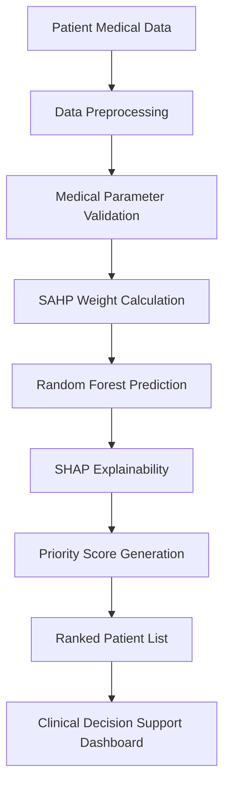

# 🏥 Smart Organ Transplant Priority Analyzer

> **An intelligent healthcare decision support platform that leverages Artificial Intelligence, Machine Learning, Structured Analytic Hierarchy Process (SAHP), and Explainable AI (SHAP) to assist clinicians in prioritizing organ transplant recipients through transparent and data-driven decision making.**

---

## 📖 Project Overview

Organ transplantation is one of the most critical healthcare processes, where selecting the most suitable recipient must consider numerous medical, ethical, and clinical factors.

**Smart Organ Transplant Priority Analyzer** is an AI-powered decision support platform that helps healthcare professionals evaluate transplant candidates using a transparent, data-driven approach.

The system combines:

- 🤖 Machine Learning (Random Forest) for priority prediction
- 📊 Structured Analytic Hierarchy Process (SAHP) for multi-criteria decision making
- 🔍 SHAP (SHapley Additive Explanations) for model interpretability
- 📈 Interactive dashboards for visualization and analytics
- 🏥 A modern healthcare-focused web interface for clinicians

The objective is **not to replace medical professionals**, but to assist them by providing explainable, evidence-based recommendations that improve decision-making and transparency.

---

# 📑 Table of Contents

- [✨ Features](#-features)
- [🧠 AI & ML Pipeline](#-ai--ml-pipeline)
- [🏗️ System Architecture](#️-system-architecture)
- [🖥️ Application Modules](#️-application-modules)
- [⚙️ Technology Stack](#️-technology-stack)
- [📂 Project Structure](#-project-structure)
- [🚀 Installation](#-installation)
- [📸 Screenshots](#-screenshots)
- [🗂️ Dataset](#️-dataset)
- [🔮 Future Scope](#-future-scope)
- [🤝 Contributors](#-contributors)
- [👩‍💻 Authors](#-authors)

---

# ✨ Features

## 🏥 Healthcare Decision Support

- Intelligent organ transplant recipient prioritization
- AI-assisted clinical decision support
- Multi-criteria patient evaluation
- Medical urgency assessment
- Risk score calculation
- Transparent recommendation generation

---

## 🤖 Artificial Intelligence

- Random Forest based prediction engine
- Explainable AI using SHAP
- Feature importance analysis
- Prediction confidence scoring
- Future-ready ML pipeline

---

## 📊 Decision Analysis

- Structured Analytic Hierarchy Process (SAHP)
- Clinical parameter weighting
- Organ allocation priority score
- Risk assessment
- Final recommendation support

---

## 📈 Dashboard & Analytics

- Interactive healthcare dashboard
- Patient statistics
- Priority distribution
- Explainability visualization
- Ranked patient analytics
- Report generation

---

## 💻 Modern User Interface

- Responsive React application
- Healthcare-inspired UI
- Interactive forms
- Search & filtering
- Responsive tables
- Smooth navigation
- Mobile-friendly layout

---

## 📄 Reporting

- Patient ranking reports
- Decision summaries
- Explainable AI reports
- Export-ready analytics

---

# 🧠 AI & ML Pipeline

The Smart Organ Transplant Priority Analyzer follows a structured Artificial Intelligence and Machine Learning workflow to provide transparent, data-driven decision support for organ transplant prioritization.

### 🔍 Workflow Description

The Smart Organ Transplant Priority Analyzer follows a structured Artificial Intelligence and Decision Support workflow to assist healthcare professionals in prioritizing organ transplant recipients.

#### 1️⃣ Patient Data Collection
- Collects demographic information, medical history, laboratory reports, and clinical parameters.
- Ensures all required patient information is available for analysis.

#### 2️⃣ Data Preprocessing
- Cleans and validates patient records.
- Handles missing or inconsistent values.
- Prepares the dataset for analysis and prediction.

#### 3️⃣ SAHP-Based Criteria Weighting
- Applies the **Structured Analytic Hierarchy Process (SAHP)** to assign weights to multiple clinical criteria.
- Supports transparent multi-criteria decision making based on medical importance.

#### 4️⃣ Machine Learning Prediction
- Uses a **Random Forest** model to estimate the transplant priority of each patient.
- Identifies patterns from historical medical data to support decision making.

#### 5️⃣ Explainable AI (SHAP)
- Generates explanations for every prediction.
- Highlights the contribution of each clinical feature towards the final prediction.
- Improves transparency and clinician trust.

#### 6️⃣ Patient Priority Ranking
- Combines Machine Learning prediction with SAHP weighting.
- Calculates an overall priority score.
- Produces a ranked list of transplant candidates.

#### 7️⃣ Clinical Decision Support
- Displays ranked patients through an interactive healthcare dashboard.
- Provides explainable recommendations to support clinicians in making informed, transparent, and data-driven decisions.

> **Note:** The current version primarily focuses on the frontend prototype. Backend integration, Machine Learning execution, SAHP computation, SHAP analysis, and database connectivity are planned for future development.